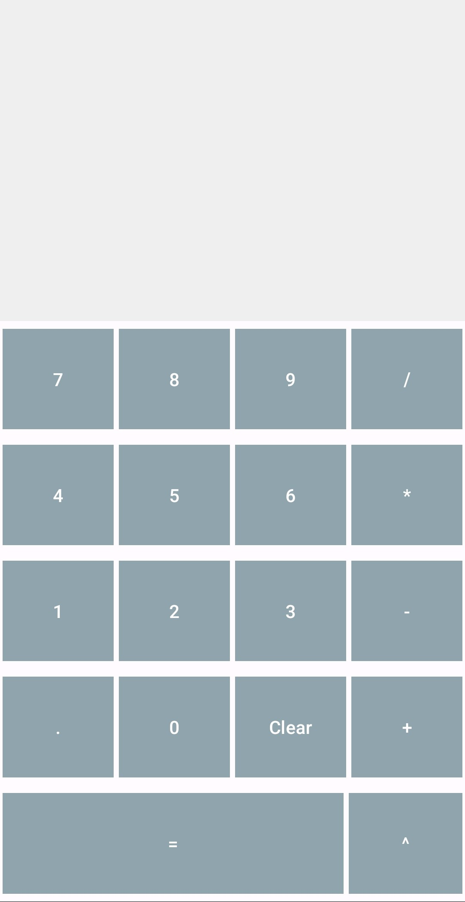
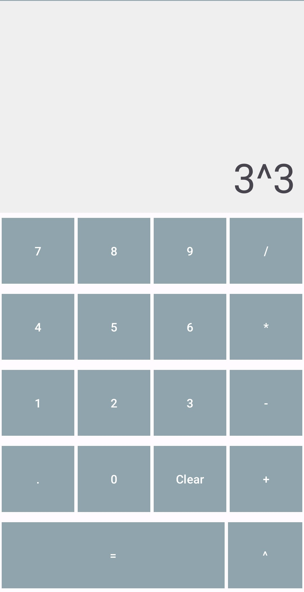
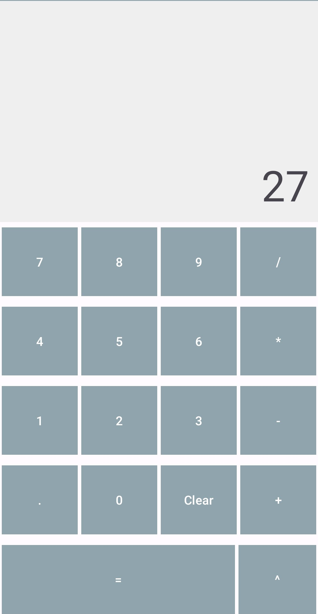

# Calculator App

A simple calculator app made while learning Android Studio and Kotlin. This application supports basic calculator support of addition, subtraction, multiplication, division, and exponential calculations.

Feel free to let me know of any bugs in this application.

## Screenshots

Default screen of the quiz application.

What could be the solution to this equation?

It's 27! :D
